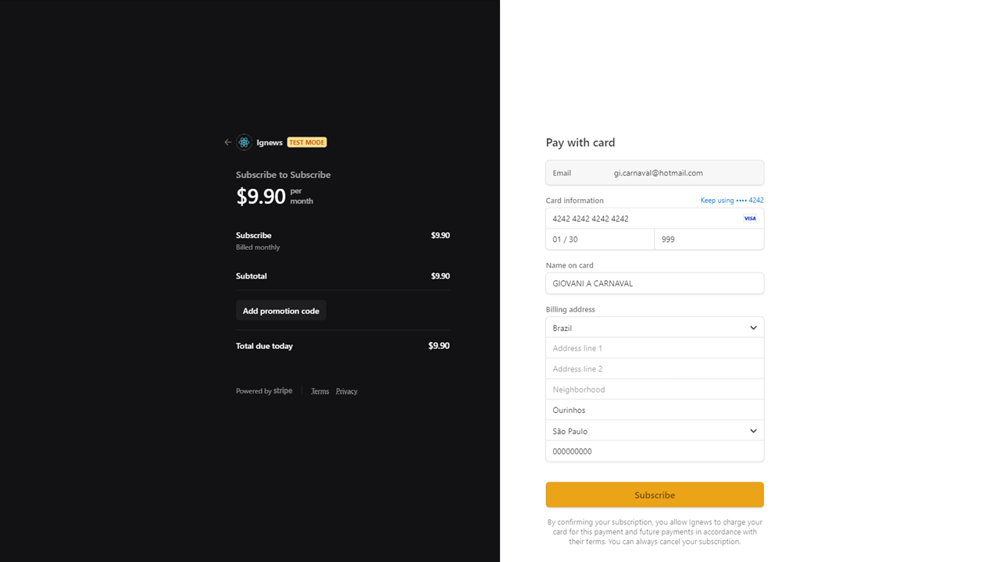

<h1 align="center">


</h1>

<p align="center">
  IGNEWS - News portal 📰🚀
  <br>
  <br>

  
  
  
  
  <a href="https://github.com/gi-carnaval/ignews/commits/main">
    
  </a>

  
</p>


<p align="center">
  <a href="#information_source-about">About</a> &#xa0; | &#xa0; 
  <a href="#bulb-technologies">Technologies</a> &#xa0; | &#xa0;
  <a href="#white_check_mark-requirements">Requirements</a> &#xa0; | &#xa0;
  <a href="#checkered_flag-starting">Starting</a> &#xa0; | &#xa0;
  <a href="#framed_picture-images">Images</a> &#xa0; &#xa0;
</p>

<br>

## :information_source: About ##


[]()

The ig.news project is a blog where the users can access the content of each post according to their subscription status.

The blog possesses a buy system integrated with STRIPE, and after the user makes the payment, their subscription will be active and ready to view the full content of the entire blog. If the user doesn't wish to opt for the subscription, he will have limited access to the content of the posts. And all the necessary data for making checks of signatures or user data, are saved in FaunaDB Database. 
<br>
<br>
This is a Serverless application, that is, the entire process that would depend on a backend was integrated within the front end and following the JAMStack standard.

Posts are made through the Prismic CMS panel and integrated directly from the front.


## :bulb: Technologies ##

The following technologies were used in the project:

- [Next.js](https://nextjs.org/)
- [Prismic CMS](https://prismic.io/)
- [Stripe](https://stripe.com/)
- [FaunaDB](https://fauna.com/)

## :white_check_mark: Requirements ##

- [Node](https://nodejs.org/en/)
- [Yarn](https://yarnpkg.com/lang/en/)

## :checkered_flag: Starting ##

```bash
# Clone this project
$ git clone https://github.com/gi-carnaval/ignews

# Access
$ cd ignews

# Install dependencies
$ yarn install

# Run the project
$ yarn dev

# The server will initialize in the <http://localhost:3000>
```
## :framed_picture: Images ##

# Desktop Layout #
<h1 align="center">
    
    
    
    
    
</h1>
# Mobile Layout #
<h1 align="center">
    
</h1>